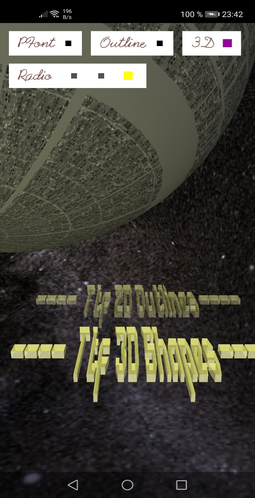

Tbw.

For now, have a look at the 

# Examples

`import forU.I.* ;`
`import forU.Ttf.* ;`

> Part of [forU](README.md).

I suggest you go through the examples in the given order, they also work as a tutorial of sorts, namely as long as there is.no documentation on `forU.I`


## UI_01_minimal

Minimal UI.
Just a ~~Butter~~ `Button` (and Toast!)

Note that pretty much everything is derived from a `Button` (even UI), and thus has all the fields and methods (like a TextView in Android,.but more so)

The key concept in forU.I is to specify actions as a `String` parameter, which identifies which method in your main sketch (or elsewhere) is to be called (and how) when the button is pressed (or the `Switch` or `Slider` changed etc.)

And it is simple, Processing style:

No ([skip](#urgh))


```Java
import android.widget.TextView;
import android.app.Activity;
import android.content.Context;
import android.widget.FrameLayout;
import android.view.ViewGroup.LayoutParams;
import android.view.Gravity;
import android.R;
import android.widget.RelativeLayout;
import processing.android.CompatUtils;
import android.graphics.Color;
import android.view.WindowManager;
import android.content.ContextWrapper;
//import android.widget.AppCompat;
import android.support.v7.view.ContextThemeWrapper;
import android.os.Bundle;
......
me.getActivity().runOnUiThread(
    new Runnable() {
    public void run() {
    
....

TextView tv = new TextView(act);  
  tv.setLayoutParams(new RelativeLayout.LayoutParams(500, 100));
  tv.setBackgroundColor(Color.GRAY);
  tv.setBackground(sd);
  tv.setX(width/2-250);
  tv.setY(height/2);
  tv.setGravity(Gravity.CENTER);
  tv.setTextColor(Color.WHITE);
  tv.setTextSize(32);
  tv.setText ("Hello world");  
  
.....

  fl = (FrameLayout)act.findViewById(R.id.content);
  FrameLayout.LayoutParams params1 = new FrameLayout.LayoutParams(LayoutParams.WRAP_CONTENT, LayoutParams.WRAP_CONTENT, Gravity.CENTER);
  fl.addView(tv);
.....
// etc pp
```

#### Urgh
   
See how forU.I handles things...

```Java

import forU.I.*;
  
  ...
     new UI(this, 64); // default button text height
     UI.add("hello","world"); // just a plain button, for now.
....
 void world(){ // gets called when the button is pressed
   println("Hello world!");
 }
 ``` 
and read on.

## UI_02_listAssets

UI with a `ListButton` showing a subdirectory of your assets, in this case `shaders`, as it always exists (injected by Processing/APDE?).
For fun, look at "" instead...on my phone dozens of files show up, probably somehow injected by Huawei...
And note that in Preview you will NOT find your own assets this way.  
See TTF_UI_04_selectfont for more explanations.

## UI_03_browseDir

Previous example expanded, shows the internal storage aka. `sketchPath()` directories you can access.
Not so interesting as an app, but try it in Preview...

Introduces 
- an optionally sorted `ListButton` with changing contents.
- a `Switch` to control sorting
- your first example subclass of `Button`, a Label to display longish pathes (feel free to find a more reasonable way to display/split it.(class File?) Let me know.)
- With this, it is a very small step (UI_??_selectFile) to a file selector without the tryToExplainMyIntendedActionAndStartItAndHopeToGetAResultWhichIUnderstandMuchLater....

Now on to some eye candy:

## TTF_01_minimal

Demonstrates a minimal environment for using Ttf.
Displays a static text with outlines.
Uses stencil.ttf

## TTF_02_glyphs

Demonstrates individual glyph access.
Displays the glyphs (fast!  change frameRate(()  
Pause and continue by tapping.

Uses damase_v.2.ttf, which has 2895 glyphs.


## TTF_03_PShape3D

Demonstrates creation of 3D shapes and texturing them.

Displays rotating "Hello World"


Uses Arkhip_font.ttf and jupiter.jpg as texture.

## TTF_UI_04_selectfont

Brings together Ttf and UI with a font selectable from a simple list.

Demonstrates consistently listing & loading fonts (or other data) from an asset subdirectory  in APDE Preview and APP.

Be warned:
 - In Preview, you will see (and  use (and crash if no font or not readable by TTFont)) all/many of the files you ever had in data/fonts since last reinstall.  
 Call it a feature, and/or praise/blame Calsign  
  (@Calsign: It should delete these each start, or at least the docs/comments say so? They for sure get overwritten. Not important...)  
 Maybe I will write some cleanup tool sometimes.  
 Remove the filter and see.
 
 - As an app, we go directly to the assets...it's the law, it's OK, it is inefficient.

Includes (and needs)  FixApplet.pde, read it.

Also provides `listAsset.pde` and `listFiles.pde` to get the contents list of an asset or normal subfolder, respectively, and
`listAssetsX() // in FixApplet.pde`
which will sort that out for you .

Demonstrates an easier way to sort (and filter) 
`ListButton` contents, see UI_03_browseDir.

Now on to more UI elements:

## UI_05_slider1

Shows a rotating box.
Introduces a `Slider`  to control the width of one dimension.

## UI_06_slider2

Adds
- Three more sliders to control the RGB color of the box.
- A `Switch`  'Follow' controling when the change is applied.

Demonstrates interaction and accessing the values of `Switch` ( `mySwitch.state` ) and `Slider` (  `mySlider.value` ).

## UI_07_slider3_sep

Builds on the above, separeted into two files:

- `UI_slider3.pde` - 
- `colorsliders.pde`

in preparation for

## UI_08_color_popup

If we want to control more than one color, things get ugly, and our UI gets crowded anyhow, so:

- Demonstrates easy  conversion of a group of controls into a popup dialog.
 - As a bonus, copies the color definition to the Android clipboard  
Thanks to
 https://github.com/EmmanuelPil/Android-java-code-utilities-widgets-for-Processing-for-Android

---


## TTF_UI_05_starscroll

Showcase Demo, Take 1...



## TTF_UI_Xx_menu

A (popup) `MenuBar`, synced `Switch`, ...

## TTF_UI_selectFile

Tbc...
