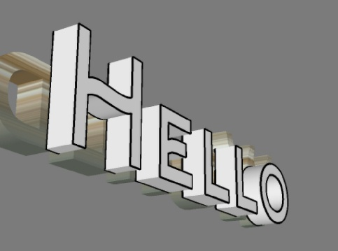
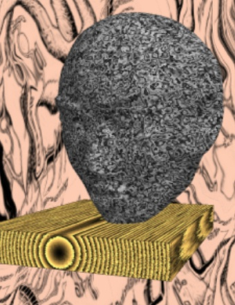
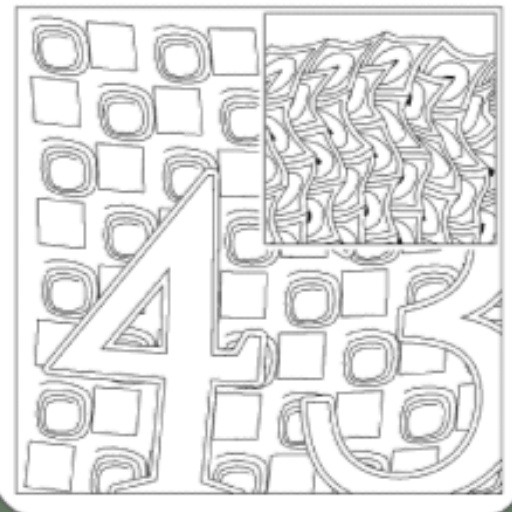

# Work in progress.

As of now (20.05.2020) I can't seem to push to a private repository, so this is public.

Still working on the docs now, standby

15.05.2020 1
- [X] Ttf useable (sans examples)

19.05.2020
- [x] Ttf ok(so far) and documented
- [x] Basic examples 

21.05.2020
- [x] More examples
- [x] Example description

Todo
- [ ] UI docs
- [ ] ...


# forU

#### Assorted Java libs made with/for [APDE](#apde)

- [Ttf](#foruttf) -Truetype font handling 
- [I](#forui) - Simple user interface
- [ClipDraw](#foruclipdraw) - Clipping with arbitrary region 
- [ForTex](forufortex) - Procedural texture generation

#### Am I reinventing the wheel?  

Up to a [point](#motivation)..


----

# forU.Ttf

## Read and render Truetype fonts.

  - Can read fonts with CMAP formats
    - 12 - Full UTF-32 coverage ( Yep, linear-b: 𐂂 if you don't see a deer head, your browser is not supporting the full UTF32 charset...)
    - 4 - UTF-16
    - 0 - ASCII
 - Base class [TTFont]( TTFont.md ) without dependencies.
- Wapper class [Ttf]( Ttf.md ) for Processing/Android/APDE convenient use. Allows to 
  - Draw to any `PGraphics` (with Glyph outline stroked!)
  - Create a 2D `PShape` 
  - Create a 3D extruded `PShape` 
  
  
  
# forU.I
  
## Simple GUI for development and demos
  
  There often is the need for a simple user interface in a sketch, be it during development or to trigger user actions.
  Available libraries for Processing depend on nonexisting  java.awt etc. or are written in a too modern Java dialect, making them impossible to use with [APDE](#apde)
  
  
  forU.I will provide that, offering
  - a basic Button class to trigger actions, ie. call a void whatever() method in your applet when pressed.
  - Switch, Slider, List, ... classes derived from that
  - Simple Text input with automatic Keyboard control (Android only)
  - The Actor class to tie these into a dialog and handle user interaction
  - much more...
  
#### Nothing to declare.
  In its most simple form all you have to do is
  
  ```Java
  import forU.I.*;
  
  void setup(){
     fullScreen(P3D);
     textSize(32); // DONT remove.
     new UI(this, 64); // default text size
     UI.add("hello","world"); // just a plain button, for now.
   }
   
 void draw(){
    background(frameCount%255);
     // your drawing code here
    UI.draw();
}

void mousePressed() {
   // UI needs to know
   if (UI.mousePressed()) return ;
   // your code here, if any.
   return;
}
   
 void world(){ // gets called when the button is pressed
   println("Hello world!");
 }
 
 ```
 to display an action button on top of your sketch display.
 
 Add more elements, customize them, connect to your sketch variables, subclass etc..
 
 ----
 
 More to come in the [forU.I Tutorial](UI.md)
 
 ----
 # Soon to come
 
 ## forU.ForTex 
 
 (will probably get its own lib)
 
 ### Procedural textures for Android.
 
  - Executed in the fragment shader
  - Compiled on the fly from a Forth-like language (ForSH) into GLSL
  - Piggybacked on PImage.
  - ...
 
 
 
 ## forU.ClipDraw
 
 (Soon)
 
- Clipping with arbitrary regions
- Offset paths (aka. Inflate/deflate/aura)
- Wraps & includes de.lighti.clipper
- ...

## forU.ForZen (work in progress)
- Procedural pattern creation trying to mimic
  -  [Zentangle](https://zentangle.com/)
  or
  - [Pattern Collections](https://pattern-collections.com/)
  drawings.
- Patterns are defined in Forth-flavoured layered script language.
  - class Doodle - "Pen and paper,;and Zen",
    - Implements [ShapeCreator](TTFont.md#shapecreator)
     - Linear and nonlinear(!) transformations
     -  "Aura" , clipping, ....
   - class ForZen - 'Brain and hand'
     - Script evaluation
     - Callback implementations like
       -  #second
       - #Text
       - ...
- Double line elimination 
- optimized GCODE generation 
- use a clothpin and a M3 screw to upgrade your 3D-Printer to a pen plotter.
- now  you see what this lib was created for



# This and that ...

## Installation

 - Unzip into
   - `Sketchbook/libraries/forU`
  so that ypu get  
    - `Sketchbook/libraries/forU'/library/`
    - `Sketchbook/libraries/forU/library-dex/`
    - `Sketchbook/libraries/forU'/examples/`
    - etc. pp.
 - or install from APDE by
    - Tools
    - Import Library
    - Manage libraries
    - Install compressed library
    - ...

 
 ## Credits
 
 #### Ketai
 
The methods for opening/closing the soft keyboard and handling  gestures on Android were copied from the [Ketai](https://github.com/ketai/ketai) library by Daniel Sauter. 
 
#### TrueType

See separate credits in [TTFont](TTFont.md)

#### APDE

And of course the incredible
 [APDE](https://github.com/Calsign/APDE/wiki/Getting-Started)

All code here was written ( if not copied from elsewhere ), edited and tested with APDE , and APDE only, on a cell phone, single-finger typing...I might explain why on another day.

Praise Calsign!

Also, the .jar and .jar-dex libraries here where created with APDE.

- [ ] write howto on creating libraries with apde

#### Markor

Never thought I would write so much doku (this)  again, and like it!

For some time, all I wrote either/and/or was ' too/not enough precise/short/long/open/understandable by the legal department/beautiful enough in general... , so that was done by others (plural!) for me...and explaining to them often ~~was~~ seemed more effort than writing it myself.

MarkDown and 

[Markor](https://github.com/gsantner/markor)

put back the fun.
Tnx.

#### Emmanuel Pil

If I had found his 
>Functions Utilities Widgets for Processing Android  
>Without third party libraries.

a year before, much of this would not have been written...still, it is a completely different approach. Tnx for the clipboard example.

[https://github.com/EmmanuelPil/Android-java-code-utilities-widgets-for-Processing-for-Android]()

#### Other Tools

Some essential, some mandatory, some recommended:

- Google

You know how that works, so
- Processing
- TrueCommander
- DiffTools
- QuickEdit
- GitHub
-  ...

## Motivation

Why did I create these libraries?

- I just could not find one fitting on my cart in the usual places or for an affordable price. So I made my own, and along the way realized others having the same problems might find them useful for their purpose. So here you are.
- All libraries I found on the web were either/or
  - Not in a Java dialect compatible with APDE
  - Not useable on Android
  - Not in Java
  - ...
- I have always hated to be dependend on components for which no source is available and recompilable by me.  All to often they just disappear at some time, become incompatible with progress or are buggy to start with...not saying that is not true for this library, but I preffer to fix my own bugs over hunting down (and trying to work around) somebody elses. The ones you find here are all mine and not to be blamed on the [credits](#credits)
- Accordingly, some pains were taken to
  -  make the key components as independend  as possible, while
  -  providing an API and interfaces as simple as possible. See [TTFont/Ttf](#foruttf)
  - make classes expandable
  
Oh, and it's a cartwheel, not a Formula1-tire - not intended for a race against hardware/bitmap backed operating system functions..but reliable bronce-age design.


## System

```
Android 10 / API 29
Baseband Version: 21C20B377S000C000,21C20B377S000C000
Build Number: YAL-L61 10.0.0.200(C431E3R1P2)
Linux Kernel Version: 4.14.116
Http User Agent: Dalvik/2.1.0 (Linux; U; Android 10; YAL-L21 Build/HUAWEIYAL-L61)
```

## License

```Java
/***************************************************************************************
 * forU.Ttf
 * Copyright (c) 2019-2020 by the author
 * @author Ullrich Heinemann , https://github.com/uheinema
 *
 * All rights reserved. 
 * A simple, platform-agnostic library for handling TrueType fonts.
 * Released under the terms of the GPLv3, refer to: http://www.gnu.org/licenses/gpl.html
 ***************************************************************************************/
```
 
 
 
 
